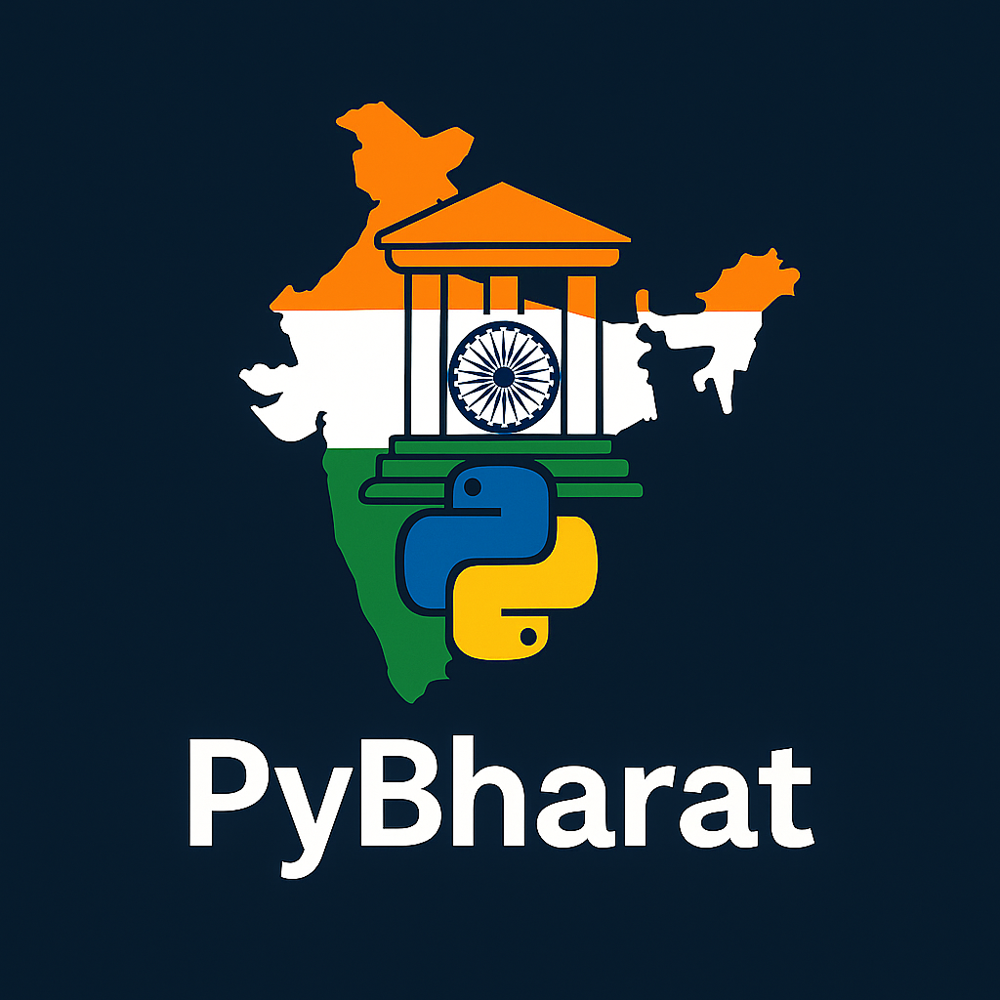

# pyBharat

<div align="center">
  

  <h1>🇮🇳 PyIndia 🐍</h1>
  <p><b>The soul of India in the power of Python</b></p>

  
</div>

---

## 🔥 What is PyBharat?

**PyBharat** is a proudly 🇮🇳 Indian-themed Python utility library built for modern developers, coders, students, and innovators. Whether you're building educational tools, regional applications, or fun projects, PyIndia blends Pythonic logic with Indian intelligence.

It’s not just a library — it’s a **Python-powered tribute to Indian tech minds**.

---

## 🚀 Features of PyBharat

| Feature | Description |
|--------|-------------|
| 🧠 **Namaste Function** | Greet users with culturally styled messages |
| 📅 **Indian Date Format** | Outputs date in DD-MMM-YYYY Indian style |
| 📍 **PIN Code Logic** | Base for integrating India-specific geo tools |
| 🗣️ **Regional Greetings** | Built-in phrases like Namaste, Vanakkam, etc. |
| 📊 **CLI tools** | Command-line tools to interact with your functions |
| 🧘 **Mantra Mode** | A creative easter-egg that prints "Om" patterns |
| 🧪 **Beginner Friendly** | Made for students, learners, and Pythonistas |
| ⚡ **Lightweight** | No heavy dependencies. Just pure Python 🇮🇳 |
| 🔗 **Modular** | Easily extendable — contribute your own features! |
| 🐍 **PyPI Ready** | Easily installable using pip |
| 💬 **Code with Culture** | A fun way to explore Indian context with Python |

---

## 🛠️ Installation

### 📦 From PyPI (soon)
```bash
pip install pyindia

git clone https://github.com/yourusername/pyindia.git
cd pyindia
pip install

from pyindia import culture, utilities

# Greet someone
culture.say_namaste("Arjun")
# Output: 🙏 Namaste, Arjun!

# Get Indian-style date
print(utilities.indian_date())
# Output: 06-July-2025

# Run mantra pattern
culture.om_wave(5)

📄 License

This project is licensed under the MIT License
© 2025 Jai Servana Bhava – India 🇮🇳


---

🙌 Join the Movement

🧘 “Code like a yogi, script like a sage.”


PyIndia is more than just a library — it’s a growing cultural and open-source movement celebrating Indian tech, language, and values.

Contribute, fork, and ⭐ star the project — and show the world your Python 🇮🇳 power!


<div align="center">🧡 💚

🇮🇳 PyIndia
Proudly Made in India
With Python. For Bharat.
🧡 💚

</div>
---
